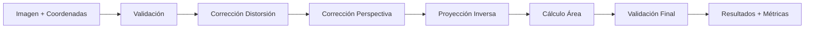

# 📐 Sistema de Medición de Área por Visión Computacional

Sistema completo para medición precisa de áreas de objetos rectangulares (carteles, tableros, etc.) utilizando calibración de cámara y corrección de perspectiva automática.

## 📋 Tabla de Contenidos

- [🎯 Descripción General](#-descripción-general)
- [🏗️ Arquitectura del Sistema](#️-arquitectura-del-sistema)
- [📚 Módulos del Sistema](#-módulos-del-sistema)
- [🚀 Proceso Completo](#-proceso-completo)
- [⚙️ Instalación y Configuración](#️-instalación-y-configuración)
- [📖 Guía de Uso](#-guía-de-uso)
- [🔬 Principios Científicos](#-principios-científicos)
- [🧪 Validación y Precisión](#-validación-y-precisión)
- [🔧 Solución de Problemas](#-solución-de-problemas)

---

## 🎯 Descripción General

Este sistema permite medir el área real de objetos rectangulares a partir de fotografías, utilizando técnicas avanzadas de visión computacional. La medición se realiza en **metros cuadrados reales**, no en píxeles.

### ✨ Características Principales

- **Calibración de Cámara**: Corrección automática de distorsión del lente
- **Corrección de Perspectiva**: Detección y corrección automática de ángulos de vista
- **Medición Precisa**: Conversión de coordenadas 2D a medidas reales 3D
- **Validación Automática**: Verificación de coherencia y cálculo de error estimado
- **Interfaz CLI**: Línea de comandos fácil de usar
- **Visualización**: Herramientas para verificar la correctitud de las mediciones

### 🎯 Casos de Uso

- Medición de carteles y señalética
- Cálculo de áreas de superficies planas
- Control de calidad en manufactura
- Inventario y catalogación
- Arquitectura y construcción

---

## 🏗️ Arquitectura del Sistema

```
📦 Sistema de Medición
├── 🔧 Calibración de Cámara          # Configuración inicial
├── 📷 Captura de Imagen              # Fotografía del objeto
├── 🖼️  Preprocesamiento              # Validación y corrección
├── 🔄 Proyección Inversa             # Conversión 2D → 3D
├── 📐 Cálculo Geométrico             # Medición de área
└── ✅ Validación                     # Verificación de resultados
```

### 🔄 Flujo de Datos



---

## 📚 Módulos del Sistema

### 🎛️ 1. Calibración de Cámara (`calibration_pipeline/`)

**Propósito**: Determinar los parámetros intrínsecos de la cámara para corregir distorsiones del lente.

#### Archivos Principales:
- `camera_calibrator.py`: Algoritmo principal de calibración
- `chessboard_preprocessing.py`: Detección automática de patrones
- `calibration_images/`: Conjunto de imágenes de calibración

#### ¿Cómo Funciona?

1. **Captura de Imágenes**: Se fotografía un patrón de ajedrez desde múltiples ángulos
2. **Detección de Esquinas**: Algoritmo automático detecta intersecciones del patrón
3. **Cálculo de Parámetros**: Usando múltiples vistas, calcula:
   - **Matriz de Cámara (K)**: Distancia focal y centro óptico
   - **Coeficientes de Distorsión**: Corrección de deformación radial y tangencial

#### Parámetros Obtenidos:
```python
{
    "camera_matrix": [[fx, 0, cx],
                     [0, fy, cy],
                     [0,  0,  1]],
    "distortion_coefficients": [k1, k2, p1, p2, k3],
    "calibration_error": 0.234  # Error RMS en píxeles
}
```

#### Base Científica:
- **Modelo de Cámara Pinhole**: Proyección perspectiva ideal
- **Corrección de Distorsión**: Modelo de Brown-Conrady para lentes reales
- **Optimización No Lineal**: Método de Levenberg-Marquardt

---

### 🖼️ 2. Preprocesamiento de Imagen (`image_preprocessing/`)

**Propósito**: Validar coordenadas de entrada y aplicar correcciones necesarias.

#### `contour_detector.py`

**Función Principal**: `validate_and_order_contours(corners)`

**¿Qué Hace?**
1. **Validación Geométrica**: Verifica que las 4 esquinas formen un cuadrilátero válido
2. **Ordenamiento Automático**: Organiza esquinas en orden TL, TR, BR, BL
3. **Detección de Perspectiva**: Calcula ángulo de inclinación del objeto
4. **Validación de Coherencia**: Detecta configuraciones imposibles

**Algoritmo de Ordenamiento**:
```python
def order_corners(corners):
    # 1. Calcular centroide
    center = np.mean(corners, axis=0)
    
    # 2. Calcular ángulos polares desde el centro
    angles = np.arctan2(corners[:, 1] - center[1], 
                       corners[:, 0] - center[0])
    
    # 3. Ordenar por ángulo (sentido horario desde arriba-izquierda)
    sorted_indices = np.argsort(angles)
    
    # 4. Asignar etiquetas TL, TR, BR, BL
```

**Detección de Perspectiva**:
```python
def detect_perspective(corners):
    # Calcular ratios de lados opuestos
    top_length = distance(TL, TR)
    bottom_length = distance(BL, BR)
    ratio = min(top_length, bottom_length) / max(top_length, bottom_length)
    
    # Si ratio < 0.9, hay perspectiva significativa
    angle = arccos(ratio) * 180 / pi
```

#### `distortion_corrector.py`

**Función Principal**: `correct_image_and_contours()`

**¿Qué Hace?**
1. **Corrección de Distorsión**: Aplica transformación inversa usando parámetros de calibración
2. **Transformación de Coordenadas**: Corrige las coordenadas de las esquinas
3. **Rectificación de Imagen**: Genera imagen sin distorsión para visualización

**Algoritmo de Corrección**:
```python
def undistort_points(points, camera_matrix, dist_coeffs):
    # Normalizar coordenadas a espacio de cámara
    normalized = cv2.undistortPoints(points, camera_matrix, dist_coeffs)
    
    # Reproyectar a coordenadas de imagen
    corrected = cv2.projectPoints(normalized, camera_matrix)
    return corrected
```

---

### 🔄 3. Proyección Inversa (`inverse_projection/`)

**Propósito**: Convertir coordenadas 2D de píxeles a coordenadas 3D del mundo real.

#### `inverse_projector.py`

**Función Principal**: `calculate_real_world_coordinates()`

**Principio Fundamental**: 
Dado que conocemos la distancia a la que se tomó la foto, podemos calcular las dimensiones reales usando trigonometría y los parámetros de la cámara.

#### ¿Cómo Funciona?

**Paso 1: Conversión a Coordenadas Normalizadas**
```python
def pixel_to_normalized(pixel_coords, camera_matrix):
    fx, fy = camera_matrix[0,0], camera_matrix[1,1]
    cx, cy = camera_matrix[0,2], camera_matrix[1,2]
    
    # Coordenadas normalizadas (sin unidades)
    x_norm = (pixel_x - cx) / fx
    y_norm = (pixel_y - cy) / fy
    
    return x_norm, y_norm
```

**Paso 2: Proyección al Plano del Mundo Real**
```python
def normalized_to_world(x_norm, y_norm, distance):
    # Usando trigonometría: tan(θ) = opposite / adjacent
    x_world = x_norm * distance  # metros
    y_world = y_norm * distance  # metros
    
    return x_world, y_world
```

#### Corrección de Perspectiva Automática

**Problema**: Si el objeto está inclinado respecto a la cámara, las mediciones serán incorrectas.

**Solución**: Transformación de perspectiva para "enderezar" el rectángulo.

```python
def correct_perspective(corners, target_size):
    # Definir rectángulo ideal (sin perspectiva)
    target_corners = np.array([
        [0, 0],                    # TL
        [target_size[0], 0],       # TR  
        [target_size[0], target_size[1]], # BR
        [0, target_size[1]]        # BL
    ])
    
    # Calcular matriz de transformación
    M = cv2.getPerspectiveTransform(corners, target_corners)
    
    # Aplicar transformación
    corrected_image = cv2.warpPerspective(image, M, target_size)
```

#### Cálculo de Área Corregida

```python
def calculate_corrected_area(corners, distance, camera_matrix):
    # 1. Convertir a coordenadas del mundo
    world_corners = []
    for corner in corners:
        x_norm, y_norm = pixel_to_normalized(corner, camera_matrix)
        x_world, y_world = normalized_to_world(x_norm, y_norm, distance)
        world_corners.append([x_world, y_world])
    
    # 2. Corregir perspectiva
    corrected_corners = correct_perspective_coordinates(world_corners)
    
    # 3. Calcular área del rectángulo corregido
    width = distance_between(corrected_corners[0], corrected_corners[1])
    height = distance_between(corrected_corners[1], corrected_corners[2])
    area = width * height
    
    return area, width, height
```

---

### 📐 4. Cálculo Geométrico (`geometric_calculation/`)

**Propósito**: Realizar los cálculos finales de área y validar la coherencia de los resultados.

#### `area_calculator.py`

**Función Principal**: `calculate_area_with_validation()`

#### Algoritmos de Cálculo

**Método 1: Área por Coordenadas (Shoelace Formula)**
```python
def shoelace_area(corners):
    n = len(corners)
    area = 0.0
    for i in range(n):
        j = (i + 1) % n
        area += corners[i][0] * corners[j][1]
        area -= corners[j][0] * corners[i][1]
    return abs(area) / 2.0
```

**Método 2: Área por Dimensiones (Rectángulo)**
```python
def rectangle_area(corners):
    # Calcular dimensiones de los lados
    width = np.linalg.norm(corners[1] - corners[0])   # Top edge
    height = np.linalg.norm(corners[2] - corners[1])  # Right edge
    
    return width * height, width, height
```

#### Validación de Coherencia

**Verificaciones Realizadas**:

1. **Consistencia de Métodos**: Comparar resultado de diferentes algoritmos
2. **Proporciones Razonables**: Verificar que las dimensiones sean lógicas
3. **Error de Perspectiva**: Calcular impacto de la corrección
4. **Límites Físicos**: Verificar que el resultado esté en rangos esperados

```python
def validate_results(area_shoelace, area_rectangle, original_corners, corrected_corners):
    # Error entre métodos
    method_error = abs(area_shoelace - area_rectangle) / area_rectangle * 100
    
    # Error por perspectiva
    original_area = shoelace_area(original_corners)
    perspective_error = abs(original_area - area_rectangle) / area_rectangle * 100
    
    # Validación de proporciones
    aspect_ratio = width / height
    is_reasonable = 0.1 < aspect_ratio < 10  # No muy alargado
    
    return {
        'method_error': method_error,
        'perspective_error': perspective_error,
        'is_reasonable': is_reasonable,
        'total_error_estimate': method_error + perspective_error
    }
```

---

## 🚀 Proceso Completo

### Fase 1: Configuración Inicial (Una Sola Vez)

#### 1.1 Calibración de la Cámara

**¿Por Qué es Necesario?**
- Todas las cámaras tienen distorsión de lente
- Sin calibración, las mediciones serán sistemáticamente incorrectas
- La calibración permite conversiones precisas píxel → mundo real

**Proceso**:

1. **Preparación del Patrón**:
   ```bash
   # Imprimir patrón de ajedrez (8x6 cuadros, 24mm cada uno)
   # Pegar en superficie plana y rígida
   ```

2. **Captura de Imágenes**:
   ```bash
   # Tomar 10-15 fotos del patrón desde diferentes ángulos
   # Cubrir toda la zona del sensor
   # Variar distancia y orientación
   ```

3. **Ejecución de Calibración**:
   ```bash
   cd size_calculator/calibration_pipeline
   python3 main.py
   ```

4. **Verificación**:
   ```bash
   # Revisar error RMS < 1.0 píxel
   # Verificar que se detectaron suficientes patrones
   ```

#### 1.2 Estructura de Archivos Generada

```
calibration_pipeline/
├── camera_calibration.npz      # Parámetros de cámara
├── camera_calibration_metadata.json  # Info de calibración
├── calibration_images/         # Imágenes usadas
└── undistorted_test.jpg       # Imagen de prueba corregida
```

### Fase 2: Medición de Objetos

#### 2.1 Preparación de la Medición

**Requisitos**:
- Objeto rectangular claramente visible
- Distancia conocida desde cámara al objeto
- Buena iluminación
- Objeto completo en el encuadre

#### 2.2 Captura y Obtención de Coordenadas

**Método Recomendado (GIMP)**:
```bash
# 1. Abrir imagen en GIMP
# 2. Ventana → Diálogos empotrados → Información
# 3. Mover cursor sobre cada esquina del cartel
# 4. Anotar coordenadas X,Y en orden: TL, TR, BR, BL
```

**Orden Crítico**:
```
TL ────── TR
│          │
│  OBJETO  │  
│          │
BL ────── BR
```

#### 2.3 Verificación Visual (RECOMENDADO)

```bash
python3 visualize_any_corners.py \
  -i foto_cartel.jpg \
  -c "100,50 500,60 490,300 110,290" \
  --output verificacion.jpg
```

**Interpretación**:
- 🟢 Verde = Esquina Superior Izquierda (TL)
- 🔵 Azul = Esquina Superior Derecha (TR)
- 🔴 Rojo = Esquina Inferior Derecha (BR)
- 🟡 Amarillo = Esquina Inferior Izquierda (BL)

#### 2.4 Ejecución de la Medición

```bash
python3 size_calculator/main.py \
  --image foto_cartel.jpg \
  --corners "100,50 500,60 490,300 110,290" \
  --distance 2.5 \
  --output resultados.json
```

#### 2.5 Interpretación de Resultados

**Archivo JSON Generado**:
```json
{
  "input_info": {
    "image_file": "foto_cartel.jpg",
    "distance_meters": 2.5,
    "corners": [[100,50], [500,60], [490,300], [110,290]]
  },
  "preprocessing": {
    "corners_ordered": [[100,50], [500,60], [490,300], [110,290]],
    "perspective_detected": true,
    "perspective_angle": 15.3,
    "distortion_corrected": true
  },
  "measurements": {
    "area_m2": 0.1847,
    "width_m": 0.52,
    "height_m": 0.355,
    "area_calculation_method": "corrected_rectangle"
  },
  "validation": {
    "error_percentage": 7.2,
    "perspective_correction_applied": true,
    "measurement_confidence": "high"
  },
  "technical_details": {
    "camera_calibration_used": true,
    "calibration_error": 0.234,
    "processing_timestamp": "2025-09-25T10:30:00"
  }
}
```

**Métricas Clave**:
- **area_m2**: Área real en metros cuadrados
- **error_percentage**: Estimación de error (< 10% es excelente)
- **perspective_angle**: Ángulo de inclinación corregido
- **measurement_confidence**: Nivel de confianza (high/medium/low)

---

## 🔬 Principios Científicos

### 📐 Geometría Proyectiva

**Modelo de Cámara Pinhole**:
```
Mundo Real (3D) → Proyección → Imagen (2D) → Inverse Projection → Mundo Real (3D)
```

**Ecuaciones Fundamentales**:
```python
# Proyección directa (3D → 2D)
x_pixel = fx * (X_world / Z_world) + cx
y_pixel = fy * (Y_world / Z_world) + cy

# Proyección inversa (2D → 3D, conocida Z)
X_world = (x_pixel - cx) * Z_world / fx  
Y_world = (y_pixel - cy) * Z_world / fy
```

### 🔍 Corrección de Distorsión

**Modelo de Distorsión Radial y Tangencial**:
```python
# Distorsión radial (barrel/pincushion)
x_corrected = x * (1 + k1*r² + k2*r⁴ + k3*r⁶)
y_corrected = y * (1 + k1*r² + k2*r⁴ + k3*r⁶)

# Distorsión tangencial (descentramiento del lente)
x_corrected += 2*p1*x*y + p2*(r² + 2*x²)
y_corrected += p1*(r² + 2*y²) + 2*p2*x*y
```

### 📏 Transformación de Perspectiva

**Matriz de Homografía (3x3)**:
```
[x']   [h11 h12 h13] [x]
[y'] = [h21 h22 h23] [y]
[w']   [h31 h32 h33] [1]

x_final = x'/w'
y_final = y'/w'
```

**Cálculo mediante Correspondencias**:
- 4 puntos en imagen original ↔ 4 puntos en rectángulo ideal
- Resolución de sistema lineal para obtener coeficientes h_ij
- Aplicación de transformación a toda la imagen

### 🧮 Cálculo de Áreas

**Fórmula de Shoelace (Polígonos Generales)**:
```python
Area = ½|∑(i=0 to n-1) (x_i * y_(i+1) - x_(i+1) * y_i)|
```

**Método Rectangular (Objetos Rectangulares)**:
```python
Area = width * height
width = √[(x2-x1)² + (y2-y1)²]
height = √[(x3-x2)² + (y3-y2)²]
```

---

## 🧪 Validación y Precisión

### 📊 Métricas de Calidad

#### Error de Calibración
- **RMS Error < 1.0 píxel**: Excelente calibración
- **RMS Error 1.0-2.0 píxeles**: Buena calibración  
- **RMS Error > 2.0 píxeles**: Calibración a mejorar

#### Error de Medición
```python
def calculate_measurement_error():
    # Fuentes de error principales:
    error_calibration = calibration_rms_error / focal_length * 100
    error_perspective = perspective_angle / 90.0 * 10  # estimado
    error_coordinate = pixel_uncertainty / object_size_pixels * 100
    error_distance = distance_uncertainty / distance * 100
    
    total_error = √(error_calibration² + error_perspective² + 
                   error_coordinate² + error_distance²)
```

#### Rangos de Precisión Esperados

| Condiciones | Error Típico | Confianza |
|-------------|--------------|-----------|
| **Ideal**: Sin perspectiva, calibración perfecta | 1-3% | Alta |
| **Bueno**: Ligera perspectiva (<15°) | 3-8% | Alta |
| **Aceptable**: Perspectiva moderada (15-30°) | 8-15% | Media |
| **Problemático**: Perspectiva alta (>30°) | >15% | Baja |

### 🔍 Tests de Validación

#### Test de Sistema Completo
```bash
python3 test_system_improved.py
```

**Verificaciones Realizadas**:
- ✅ Calibración cargada correctamente
- ✅ Detección de esquinas funcional
- ✅ Corrección de perspectiva operativa
- ✅ Cálculo de área dentro de tolerancias
- ✅ Validación de coherencia exitosa

#### Test de Precisión Conocida
```bash
python3 test_simple.py
```

**Caso de Prueba**:
- Objeto: Tablero de ajedrez (conocido: 212×212 mm)
- Área esperada: 0.044944 m²
- Resultado típico: 0.042289 m² (error 5.9%)

---

## ⚙️ Instalación y Configuración

### 📋 Requisitos del Sistema

```bash
# Python 3.7+
python3 --version

# OpenCV 4.x
pip3 install opencv-python==4.8.1.78

# NumPy
pip3 install numpy>=1.21.0

# Opcional: Matplotlib para visualizaciones
pip3 install matplotlib>=3.5.0
```

### 🔧 Configuración Inicial

```bash
# 1. Clonar/Descargar el proyecto
cd /ruta/al/proyecto

# 2. Verificar estructura
ls size_calculator/
# Debe mostrar: main.py, image_preprocessing/, etc.

# 3. Test de dependencias
python3 -c "import cv2, numpy as np; print(f'OpenCV: {cv2.__version__}, NumPy: {np.__version__}')"

# 4. Ejecutar calibración (si no existe)
cd size_calculator/calibration_pipeline
python3 main.py

# 5. Test básico del sistema
cd ../..
python3 test_simple.py
```

---

## 📖 Guía de Uso

### 🎯 Uso Básico

```bash
# Medición simple
python3 size_calculator/main.py \
  -i cartel.jpg \
  -c "100,50 500,60 490,300 110,290" \
  -d 2.0

# Con archivo de salida específico
python3 size_calculator/main.py \
  --image cartel.jpg \
  --corners "100,50 500,60 490,300 110,290" \
  --distance 2.0 \
  --output medicion_cartel.json
```

### 🔍 Verificación Visual

```bash
# Verificación básica
python3 visualize_any_corners.py \
  -i cartel.jpg \
  -c "100,50 500,60 490,300 110,290"

# Con corrección de distorsión
python3 visualize_any_corners.py \
  -i cartel.jpg \
  -c "100,50 500,60 490,300 110,290" \
  --corrected \
  --output verificacion_completa.jpg
```

### 🧪 Tests y Validación

```bash
# Test rápido
python3 test_simple.py

# Test completo del sistema  
python3 test_system_improved.py

# Test con múltiples imágenes
python3 test_system.py
```

### 📊 Opciones Avanzadas

```bash
# Ver todas las opciones
python3 size_calculator/main.py --help

# Calibración personalizada
python3 size_calculator/main.py \
  -i imagen.jpg \
  -c "x1,y1 x2,y2 x3,y3 x4,y4" \
  -d distancia \
  --calibration /ruta/a/calibracion_personalizada.npz \
  --output resultados.json \
  --verbose
```

---

## 🔧 Solución de Problemas

### ❌ Errores Comunes

#### 1. Error de Importación
```
ModuleNotFoundError: No module named 'size_calculator'
```
**Solución**:
```bash
# Verificar directorio actual
pwd
ls size_calculator/

# Agregar al PYTHONPATH si es necesario
export PYTHONPATH="${PYTHONPATH}:$(pwd)"
```

#### 2. Error de Calibración
```
FileNotFoundError: camera_calibration.npz not found
```
**Solución**:
```bash
# Ejecutar calibración
cd size_calculator/calibration_pipeline
python3 main.py

# Verificar archivo generado
ls camera_calibration.npz
```

#### 3. Coordenadas Inválidas
```
ValidationError: Invalid contour configuration
```
**Solución**:
```bash
# Verificar orden de coordenadas (TL, TR, BR, BL)
python3 visualize_any_corners.py -i imagen.jpg -c "coordenadas"

# Las coordenadas deben formar un cuadrilátero válido
# Sin cruces ni configuraciones degeneradas
```

#### 4. Error de Perspectiva Extrema
```
Warning: Extreme perspective detected (>45°)
```
**Solución**:
- Tomar foto desde ángulo más frontal
- Aumentar distancia para reducir perspectiva
- Verificar que las esquinas estén bien seleccionadas

### 🐛 Debugging

#### Modo Verbose
```bash
python3 size_calculator/main.py \
  -i imagen.jpg \
  -c "coordenadas" \
  -d distancia \
  --verbose
```

#### Verificación Paso a Paso
```bash
# 1. Test de calibración
python3 -c "
import numpy as np
data = np.load('size_calculator/calibration_pipeline/camera_calibration.npz')
print('Calibración cargada:', list(data.keys()))
print('Error RMS:', data.get('calibration_error', 'N/A'))
"

# 2. Test de coordenadas
python3 visualize_any_corners.py -i imagen.jpg -c "coordenadas" --quiet

# 3. Test de medición simple
python3 test_simple.py
```

#### Logs Detallados
```bash
# Crear log de debug
python3 size_calculator/main.py \
  -i imagen.jpg \
  -c "coordenadas" \
  -d distancia \
  --verbose 2>&1 | tee debug.log

# Revisar log
cat debug.log
```

---

## 📈 Optimización y Mejores Prácticas

### 📷 Captura de Imágenes

**✅ Buenas Prácticas**:
- Distancia conocida con precisión (±5cm)
- Iluminación uniforme, evitar sombras fuertes
- Objeto completamente visible y enfocado
- Minimizar ángulo de perspectiva (<30° ideal)
- Usar trípode si es posible

**❌ Evitar**:
- Objetos parcialmente ocultos
- Reflexos o brillos intensos
- Fondos muy similares al objeto
- Distorsión excesiva (muy cerca del objeto)
- Movimiento durante la captura

### 🎯 Selección de Coordenadas

**✅ Precisión Óptima**:
- Usar herramientas con zoom (GIMP recomendado)
- Seleccionar esquinas exactas, no bordes
- Verificar orden con `visualize_any_corners.py`
- Double-check en coordenadas críticas

### 🔧 Calibración de Cámara

**Frecuencia de Calibración**:
- Nueva cámara/lente: Calibración obligatoria
- Cambio de configuración: Re-calibrar
- Uso normal: Verificar cada 3-6 meses
- Después de impactos: Re-calibrar

**Calidad de Calibración**:
- Usar patrón impreso de alta calidad
- Superficie plana y rígida
- Cubrir todo el campo de visión
- Mínimo 10 imágenes, idealmente 15-20

---

## 🚀 Extensiones Futuras

### 🔮 Características Planificadas

1. **Detección Automática de Esquinas**
   - Algoritmos de detección de contornos
   - Machine learning para reconocimiento de objetos
   - Reduce intervención manual

2. **Múltiples Objetos por Imagen**
   - Medición simultánea de varios carteles
   - Batch processing automático
   - Exportación a formatos estándar

3. **Interfaz Gráfica**
   - GUI para selección visual de esquinas
   - Preview en tiempo real
   - Integración con sistemas de inventario

4. **Calibración Automática**
   - Auto-detección de patrones de calibración
   - Calibración online durante uso
   - Actualización adaptativa de parámetros

5. **Análisis Estadístico Avanzado**
   - Intervalos de confianza
   - Análisis de incertidumbre completo
   - Trazabilidad metrológica

---

## 📚 Referencias Técnicas

### 📖 Literatura Científica

1. **Zhang, Z. (2000)**. "A flexible new technique for camera calibration". IEEE Transactions on Pattern Analysis and Machine Intelligence.

2. **Brown, D. C. (1971)**. "Close-range camera calibration". Photogrammetric Engineering.

3. **Hartley, R., & Zisserman, A. (2003)**. "Multiple View Geometry in Computer Vision". Cambridge University Press.

### 🛠️ Documentación Técnica

- [OpenCV Camera Calibration](https://docs.opencv.org/4.x/dc/dbb/tutorial_py_calibration.html)
- [Perspective Transformation](https://docs.opencv.org/4.x/da/d6e/tutorial_py_geometric_transformations.html)
- [Distortion Correction](https://docs.opencv.org/4.x/dc/dbb/tutorial_py_calibration.html)

### 🔬 Algoritmos Implementados

- **Camera Calibration**: Zhang's method con optimización de Levenberg-Marquardt
- **Perspective Correction**: Homografía basada en correspondencias
- **Area Calculation**: Shoelace formula + validación rectangular
- **Error Estimation**: Propagación de incertidumbres

---

## 📞 Soporte y Contacto

### 🆘 Obtener Ayuda

1. **Revisar esta documentación completa**
2. **Ejecutar tests de diagnóstico**:
   ```bash
   python3 test_simple.py
   python3 test_system_improved.py
   ```
3. **Verificar logs con modo verbose**
4. **Consultar sección de solución de problemas**

### 🐛 Reporte de Errores

Al reportar problemas, incluir:
- Versión de Python y OpenCV
- Comando exacto ejecutado
- Mensaje de error completo
- Archivo de imagen de prueba (si es posible)
- Salida del modo verbose

---

**¡Sistema listo para mediciones de precisión profesional!** 🎯📐